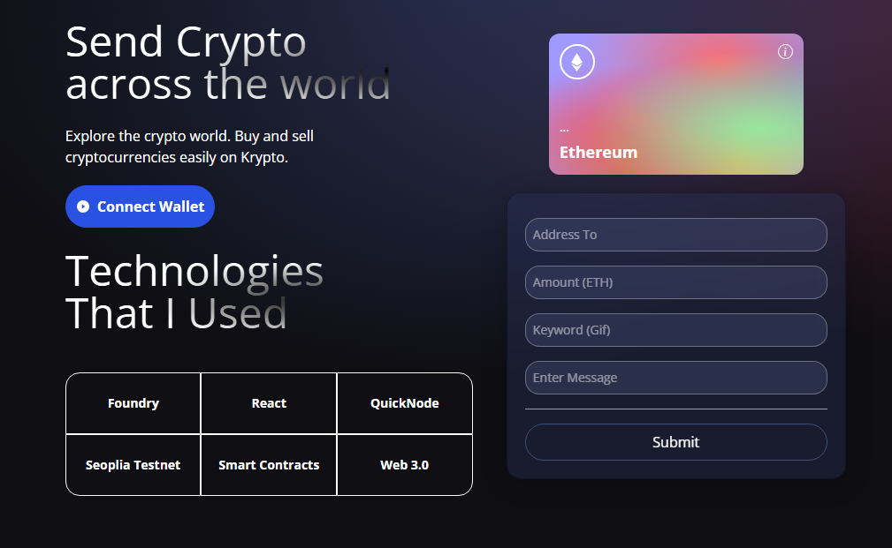
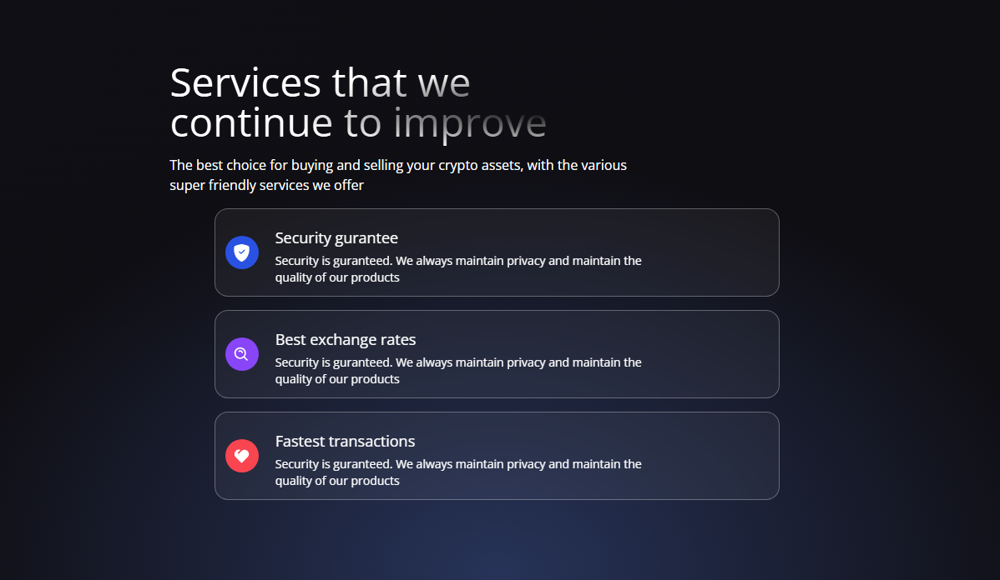
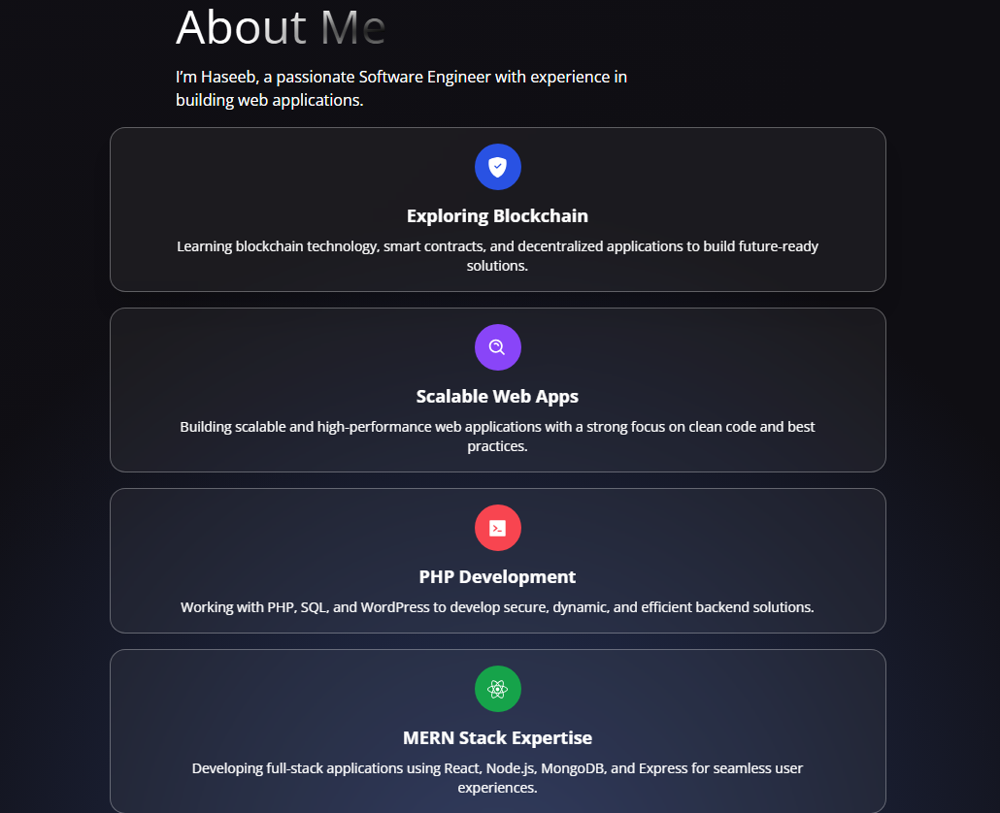

# Web3Hive 🐝



## About Web3Hive

**Web3Hive** is a polished decentralized web application that empowers users to send **ETH**, attach a **personal message**, and add a **GIF from Giphy** to create memorable on-chain interactions.

This repository combines a modern React frontend with a secure Ethereum smart contract backend, making crypto transactions feel engaging, expressive, and user-friendly.

---

## 🚀 Why Web3Hive?

- **Expressive payments** with message + GIF support
- **Secure wallet connection** via MetaMask
- **Transaction history** accessible directly in the app
- **Modern UI/UX** using Tailwind CSS and Framer Motion
- **Built for learning and sharing** by the Web3 community

---

## 🧠 What’s Included

### Frontend
- React 19
- Vite
- Ethers.js 6
- Tailwind CSS
- Framer Motion
- React Router DOM
- Giphy API integration

### Smart Contracts
- Foundry-powered Solidity development
- Simple ETH transfer contract with message storage
- Test coverage using Foundry's Forge

---

## 🌟 Project Highlights

### Interactive Transaction Experience


- Send ETH with a message and GIF
- Store transaction details on-chain
- View past transactions in the dashboard

### Clean Design & Animation


- Smooth transitions
- Responsive layout for all screens
- Focus on usability and visual appeal

### Developer Friendly
- Clear project separation between `client/` and `smart_contract/`
- Ready-to-run frontend and contract testing setup
- Ideal for showcasing Web3 skills and attracting followers

---

## 📁 Repository Structure

- `client/` — React frontend
- `smart_contract/` — Foundry smart contract project
- `client/images/` — UI assets used in the README and app

---

## 🛠 Installation

### Frontend
```bash
cd client
npm install
npm run dev
```

### Smart Contracts
```bash
cd smart_contract
forge build
forge test
```

> Note: Foundry must be installed to build and test the smart contracts.

---

## 📌 Live Demo

🔗 [Web3Hive Demo](https://haseeb2412.github.io/Web3Hive/)

---

## 💬 Share & Connect

If you publish this repository, use the visuals, project flow, and social sharing to attract followers:

- Showcase the **interactive ETH + GIF send flow**
- Highlight the **smart contract learning path**
- Promote the project as a **Web3 portfolio piece**

---

## 🧾 License

This project is open source and ready for contributions. Feel free to fork, star, and share!
